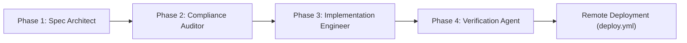

# SDD Multi-Agent Orchestrator Skill

Use this skill whenever orchestrating multi-agent tasks, major feature implementations, or refactors in the **Yaron Lavi Portfolio & Platform Engineering Showcase** repository.

This skill operationalizes [specs/06-agent-orchestration-spec.md](file:///Users/yaron/work/git/Web/specs/06-agent-orchestration-spec.md).

---

## 1. The 4-Agent Pipeline Workflow

Every non-trivial change MUST progress through the four handover gates:



### Phase 1: Spec Architect Gate
- **Input:** User prompt or task from [`specs/05-tasks-and-roadmap.md`](file:///Users/yaron/work/git/Web/specs/05-tasks-and-roadmap.md).
- **Mandate:**
  1. Inspect existing specifications in `specs/`.
  2. Author or update relevant specification files (`01` through `06`).
  3. Detail schema shifts in [`specs/03-data-schema-spec.md`](file:///Users/yaron/work/git/Web/specs/03-data-schema-spec.md) if fields change.
- **Pass Criteria:** Explicit requirements, component impacts, and verification criteria documented in `specs/`.

### Phase 2: Compliance & Guardrail Gate
- **Input:** Proposed specification and planned changes.
- **Mandate:** Activate [`.agents/skills/guardrail-compliance-auditor/SKILL.md`](file:///Users/yaron/work/git/Web/.agents/skills/guardrail-compliance-auditor/SKILL.md) and verify:
  1. **Topic Boundaries:** ZERO military or IDF affiliations.
  2. **Profile Ground Truth:** Confirms alignment with `yaron-profile-sync` and `resources/resume.md`.
  3. **Zero Local Install:** Confirms no local `npm install`, `vite build`, or dependencies are required.
  4. **Content Decoupling:** Ensures changes target `portfolio.config.js` and keep `src/App.jsx` presentation-only.
- **Pass Criteria:** 100% compliance clearance sign-off.

### Phase 3: Implementation Engineer Gate
- **Input:** Approved spec and compliance clearance.
- **Mandate:**
  1. Make targeted edits to [`portfolio.config.js`](file:///Users/yaron/work/git/Web/portfolio.config.js).
  2. Update [`src/App.jsx`](file:///Users/yaron/work/git/Web/src/App.jsx) only for structural presentation logic.
- **Pass Criteria:** Edits match the specification exactly with no superfluous modifications.

### Phase 4: Verification & Delivery Gate
- **Input:** Code modifications.
- **Mandate:**
  1. Static syntax verification (non-destructive node syntax/AST check).
  2. Markdown link verification.
  3. Ensure workspace is clean (`git status` contains no `node_modules` or `dist`).
  4. Conventional commit formatting (`feat:`, `docs:`, `fix:`, `refactor:`).
- **Pass Criteria:** Clean static check and readiness for remote GitHub Actions runner.

---

## 2. Standard Subagent Invocation Templates

When dispatching tasks via `invoke_subagent`, use the following role prompts:

### Spec Architect Subagent
```javascript
invoke_subagent([{
  TypeName: "research",
  Role: "Spec Architect",
  Prompt: `Analyze the user request: "${taskDescription}".
Review specs/01-product-spec.md through specs/06-agent-orchestration-spec.md.
Draft the required specification updates in specs/, defining data models and acceptance criteria.
Do not modify src/ or portfolio.config.js.`
}])
```

### Compliance Auditor Subagent
```javascript
invoke_subagent([{
  TypeName: "self",
  Role: "Compliance Auditor",
  Prompt: `Audit the planned changes for task "${taskDescription}".
Activate .agents/skills/guardrail-compliance-auditor/SKILL.md.
Verify:
1. Zero military or IDF affiliations in copy or code.
2. Alignment with Yaron's verified resume in .agents/skills/yaron-profile-sync/resources/resume.md.
3. Content is strictly decoupled in portfolio.config.js.
4. No local npm install or build commands are run.
Report compliance approval or explicit violations.`
}])
```

### Implementation Engineer Subagent
```javascript
invoke_subagent([{
  TypeName: "self",
  Role: "Implementation Engineer",
  Prompt: `Implement the approved spec for "${taskDescription}".
Update portfolio.config.js (and src/App.jsx only if presentation logic is needed).
Strictly avoid hardcoding content in App.jsx.
Never run npm install or local build commands.`
}])
```

### Verification & Delivery Subagent
```javascript
invoke_subagent([{
  TypeName: "self",
  Role: "Verification Agent",
  Prompt: `Verify changes for "${taskDescription}".
Check JS syntax of modified files.
Verify markdown links in specs/.
Check git status to ensure no node_modules/ or dist/ directories exist.
Formulate a conventional commit message.`
}])
```
