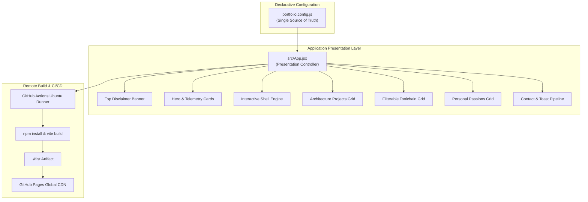

# Spec 02: System Architecture & Delivery Specification

## 1. Architectural Overview

The portfolio follows a **declarative, decoupled single-page application (SPA)** architecture compiled via Vite and React, styled with utility-first Tailwind CSS, and delivered globally through GitHub Pages edge CDN.



---

## 2. Component Hierarchy

```
App.jsx (Root)
│
├── Top Disclaimer Banner (Conditional: disclaimerBanner.enabled && !dismissed)
│   ├── Badge & Bot Icon
│   ├── Copy Notice
│   └── Dismiss Button (X)
│
├── Header & Sticky Navigation
│   ├── Brand Avatar ("YL") & Title
│   ├── Nav Links (#terminal, #projects, #skills, #highlights, #contact)
│   ├── GitHub Direct Link
│   └── Copy Email Quick Action
│
├── Main Container
│   ├── Hero Section
│   │   ├── Status Pill
│   │   ├── Headline & Specialization Bio
│   │   ├── 4x Metric Telemetry Cards
│   │   └── Call-to-Action Buttons
│   │
│   ├── Interactive Terminal Section
│   │   ├── Shell Header & Quick Action Buttons
│   │   ├── Terminal Window Chrome (macOS dots, host status)
│   │   ├── Scrollback Log Output Buffer
│   │   └── Shell Input Form & Submit Trigger
│   │
│   ├── Projects Section
│   │   ├── Section Header
│   │   └── 4x Project Cards (Badges, Description, Highlights, Tags)
│   │
│   ├── Skills Section
│   │   ├── Category Filter Tabs (All, Orchestration, GitOps, Observability, Languages)
│   │   └── Dynamic Skill Chips Grid
│   │
│   ├── Personal Passions Section
│   │   └── 3x Craft Cards (Calisthenics, Mixology, Rock Music)
│   │
│   └── Contact Section
│       ├── Header & Outreach Statement
│       ├── Send Email Button
│       ├── Copy Email Button (With Toast Trigger)
│       ├── GitHub Link
│       └── Reactive Toast Notification
│
└── Footer Section
    ├── Copyright Statement
    └── Automated CI/CD Pages Indicator
```

---

## 3. Remote Build & Delivery Architecture

### 3.1 Dynamic Base Path Resolution
Vite dynamically computes its asset `base` based on the GitHub repository name injected by the GitHub Actions runner:

```javascript
// vite.config.js
export default defineConfig({
  plugins: [react()],
  base: process.env.GITHUB_REPOSITORY
    ? `/${process.env.GITHUB_REPOSITORY.split('/')[1]}/`
    : '/',
})
```

- When built in CI: `GITHUB_REPOSITORY = "YaronL16/Web"` $\rightarrow$ `base = "/Web/"`
- When built locally (if ever executed): `base = "/"`

### 3.2 GitHub Actions Deployment Workflow (`.github/workflows/deploy.yml`)

1. **Trigger:** `push` events to `main` branch and manual `workflow_dispatch`.
2. **Permissions:**
   - `contents: read` (checkout source code)
   - `pages: write` (authorize deployment to Pages)
   - `id-token: write` (OIDC verification for GitHub Pages)
3. **Concurrency:** `group: pages`, `cancel-in-progress: false` (prevents race conditions during active deployments).
4. **Build Phase:**
   - Runner: `ubuntu-latest`
   - Node Environment: `Node.js 20`
   - Execution: `npm install` $\rightarrow$ `npm run build`
   - Output: Uploads `./dist` via `actions/upload-pages-artifact@v3`.
5. **Deploy Phase:**
   - Environment: `github-pages`
   - Action: `actions/deploy-pages@v4` publishes the artifact to `https://yaronl16.github.io/Web/`.
