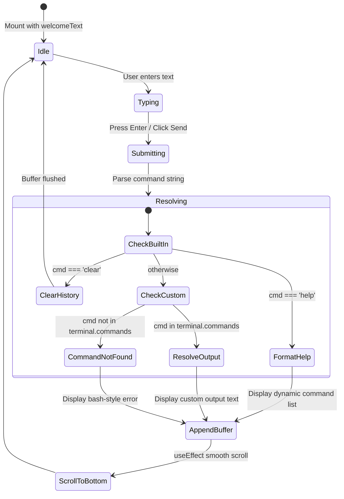

# Spec 04: Interactive Terminal Engine Specification

## 1. Component Goal & UX Model

The Interactive Terminal simulates a Unix shell session (`yaron@platform-node-01:~$`), presenting an engineer-centric playground that allows visitors to explore credentials, architectures, and cluster states through a CLI metaphor.

---

## 2. State Machine & Execution Lifecycle

---

## 3. Command Resolution Rules

1. **Normalization:**
   Input strings are stripped of leading/trailing whitespace and converted to lower case:
   `normalized = input.trim().toLowerCase()`
2. **Built-in Commands:**
   - `clear`: Flushes `terminalHistory` state to an empty array `[]`.
   - `help`: Inspects `Object.keys(terminal.commands)` and dynamically constructs a tabular list of all available commands followed by `clear`.
3. **Configured Commands:**
   - Any key matching `terminal.commands[normalized]` prints the associated string with line break preservation inside `<pre>` formatting.
4. **Fallback:**
   - Returns: `bash: command not found: "${trimmed}". Type "help" to inspect valid commands.` in red accent styling (`text-rose-400`).

---

## 4. UI/UX Features

- **Chrome:** Window decoration styling with macOS red/amber/green window controls, node hostname, and UTF-8 encoding badge.
- **Auto-scroll:** `terminalEndRef` automatically triggers smooth scrolling into view whenever `terminalHistory` receives a new entry.
- **Quick-Run Chips:** Buttons above the terminal allow mobile and mouse-first users to click commands (`whoami`, `skills`, `projects`, etc.) without typing.
