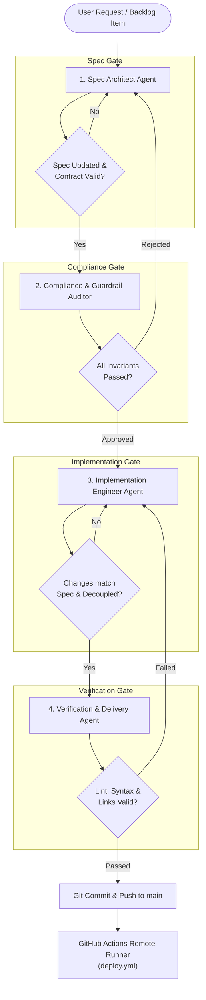

# Spec 06: Multi-Agent Orchestration Specification

## 1. Architectural Objective & SDD Alignment

This specification formalizes the **Multi-Agent Orchestration Architecture** governing development, refactoring, and maintenance in this repository. 

Under **Spec-Driven Development (SDD)**, software construction is not a monolith executed by a single generic model. Instead, autonomous coding agents operate as a coordinated, specialized collective where:
1. **No code or configuration is modified before its specification is approved.**
2. **Strict non-negotiable invariants (guardrails) are enforced by independent automated audit gates.**
3. **Roles are discrete, hermetic, and verifiable.**

---

## 2. Agent Topology & Persona Definitions

The orchestration topology consists of four discrete agent personas operating in sequence or bounded loops:



### 2.1 Persona Roles & Tool Contracts

| Persona | Core Responsibility | Permitted Tooling / Scope | Invariant Focus |
| :--- | :--- | :--- | :--- |
| **Spec Architect Agent** | Requirements distillation, updating `specs/*.md`, and defining data contracts in `specs/03-data-schema-spec.md`. | Read/Write to `specs/`, Read-only on codebase. | Ensures zero undocumented code exists. |
| **Compliance & Guardrail Auditor Agent** | Pre-flight and post-flight automated invariant auditing. | Read-only scanner across all files; runs regex/AST checks. | • Complete omission of military/IDF references.<br/>• Source-of-truth compliance with `yaron-profile-sync` / resume.<br/>• Zero local `npm install` or local build execution.<br/>• Strict content decoupling from `src/App.jsx`. |
| **Implementation Engineer Agent** | Code and configuration synthesis adhering strictly to the approved specification. | Write access to `portfolio.config.js` and `src/`. | Strictly avoids touching presentation code for content updates. |
| **Verification & Delivery Agent** | Syntax verification, schema validation, commit message construction, and CI/CD monitoring. | Read-only verification, git commands, CI monitoring. | Verifies zero workspace pollution (`node_modules`, `dist`), clean git status, and successful remote build on GitHub Pages. |

---

## 3. Orchestration Lifecycle & Handover Contracts

### 3.1 Phase 1: Specification & Contract Design
- **Trigger:** A new backlog item (`specs/05-tasks-and-roadmap.md`) or user prompt.
- **Agent:** `Spec Architect Agent`.
- **Action:**
  1. Inspect existing specs (`specs/01` through `specs/05`).
  2. Draft or update relevant sections in `specs/` describing requirements, component changes, data schema shifts, and terminal command definitions.
  3. Formulate the implementation plan.
- **Handover Artifact:** Updated markdown specifications in `specs/` and clear acceptance criteria.

### 3.2 Phase 2: Invariant & Compliance Gate
- **Trigger:** Specification ready for review.
- **Agent:** `Compliance & Guardrail Auditor Agent`.
- **Action:**
  1. Scan planned content against the `yaron-profile-sync` ground truth (`resources/resume.md` and LinkedIn).
  2. Verify no prohibited military, IDF, or defense terminology is introduced.
  3. Ensure that the proposed change plans for declarative configuration (`portfolio.config.js`) rather than hardcoded UI components.
  4. Confirm no local build or package install commands are planned.
- **Handover Artifact:** Compliance Clearance Sign-off (or rejection notice with specific remediation requirements).

### 3.3 Phase 3: Declarative Implementation
- **Trigger:** Compliance Clearance granted.
- **Agent:** `Implementation Engineer Agent`.
- **Action:**
  1. Update `portfolio.config.js` (for content, stats, projects, skills, terminal commands).
  2. Modify `src/App.jsx` or Tailwind styles **only** if presentation structure or layout requires architectural enhancement.
  3. Keep changes minimal, clean, and declarative.
- **Handover Artifact:** File diffs restricted exclusively to target config and presentation files.

### 3.4 Phase 4: Static Verification & Remote Delivery
- **Trigger:** Code edits complete.
- **Agent:** `Verification & Delivery Agent`.
- **Action:**
  1. Perform non-destructive AST/syntax checks on modified JavaScript files.
  2. Verify markdown links and heading anchors in specs.
  3. Re-verify repository cleanliness (`git status` contains no `node_modules`, `dist`, or temporary build files).
  4. Prepare conventional commit message (`feat:`, `docs:`, `fix:`, `refactor:`).
  5. Verify remote deployment status on GitHub Actions runner (`.github/workflows/deploy.yml`).
- **Handover Artifact:** Verified commit and deployment confirmation.

---

## 4. Rejection & Remediation Protocol

If an invariant is violated at any stage:
1. **Immediate Halt:** The auditing or verifying agent issues an explicit invariant violation error identifying the exact file, line, and rule violated.
2. **No Fall-Forward on Invariants:** Violations cannot be waived or bypassed.
3. **Rollback / Correction:** The task is routed back to Phase 1 (for spec/content boundary violations) or Phase 3 (for code decoupling/syntax issues) before any git commit is authorized.

---

## 5. Execution Modes

The orchestration specification supports two operational modes:

### Mode A: Subagent Concurrency (Single-Session Invocation)
The parent agent invokes subagents using `invoke_subagent`:
```javascript
invoke_subagent([
  {
    TypeName: "research",
    Role: "Spec Architect",
    Prompt: "Audit specs/05-tasks-and-roadmap.md and draft specification for FEAT-001..."
  },
  {
    TypeName: "self",
    Role: "Compliance Auditor",
    Prompt: "Run guardrail compliance audit on proposed changes against AGENTS.md..."
  }
])
```

### Mode B: Swarm / Teamwork Mode (`/teamwork-preview`)
When broad refactoring or multi-feature roadmap execution is initiated, the team splits roles autonomously across dedicated workspace contexts, syncing state via Git and the shared `specs/` directory as the central blackboard.
