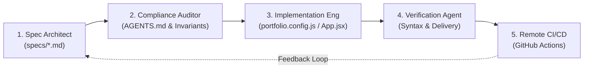

# Spec-Driven Development (SDD) — Platform Architecture & Documentation

> *"Talk is cheap. Show me the code."* — Linus Torvalds  
> *"Code is disposable. Show me the specification."* — Agentic Software Engineering in 2026

Welcome to the official specification directory for the **Yaron Lavi Portfolio & Platform Engineering Showcase**.

This repository adheres strictly to **Spec-Driven Development (SDD)**: every feature, architectural boundary, data contract, and terminal behavior is specified in writing before implementation, providing a single source of truth for both human contributors and autonomous coding agents.

---

## 📑 Specification Index

| Document | Purpose & Scope | Status |
| :--- | :--- | :---: |
| **[01-product-spec.md](./01-product-spec.md)** | Product vision, target personas, functional requirements, constraints, and non-goals. | `FINAL` |
| **[02-architecture-spec.md](./02-architecture-spec.md)** | Component hierarchy, Vite build system, GitHub Pages delivery pipeline, and security model. | `FINAL` |
| **[03-data-schema-spec.md](./03-data-schema-spec.md)** | Formal schema, TypeScript interfaces, validation rules, and icon mapping for `portfolio.config.js`. | `FINAL` |
| **[04-terminal-engine-spec.md](./04-terminal-engine-spec.md)** | Shell lifecycle, command execution pipeline, history management, and keyboard handling. | `FINAL` |
| **[05-tasks-and-roadmap.md](./05-tasks-and-roadmap.md)** | Prioritized backlog, implementation status, and acceptance criteria for future milestones. | `ACTIVE` |
| **[06-agent-orchestration-spec.md](./06-agent-orchestration-spec.md)** | Multi-agent orchestration topology, persona contracts, handover state machine, and audit gates. | `FINAL` |

---

## 🔄 The SDD Multi-Agent Workflow Lifecycle

### Core Principles
1. **Zero Undocumented Code:** No component or behavior exists without a corresponding requirement in the spec.
2. **Decoupled Content Layer:** Content changes never require source-code alterations (`portfolio.config.js` is the sole declarative interface).
3. **Hermetic Remote Execution:** All dependency resolution, bundling, and verification occur strictly on remote GitHub Actions runners—zero local `node_modules` pollution.
4. **Deterministic Declarativism:** Infrastructure and application states are declared, tracked in Git, and synced via continuous delivery.
